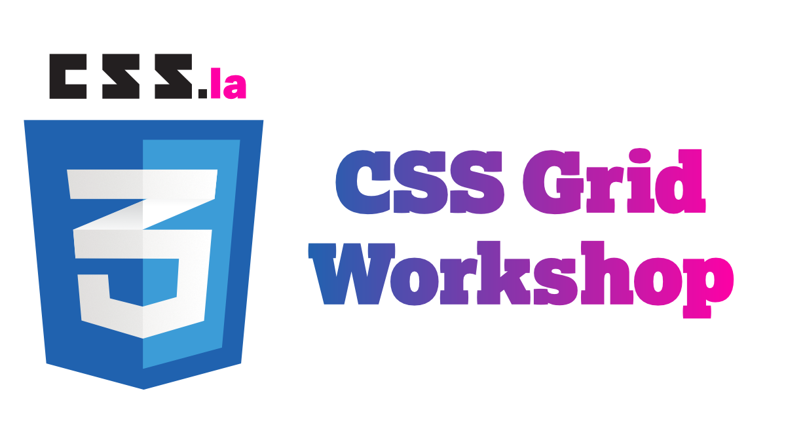
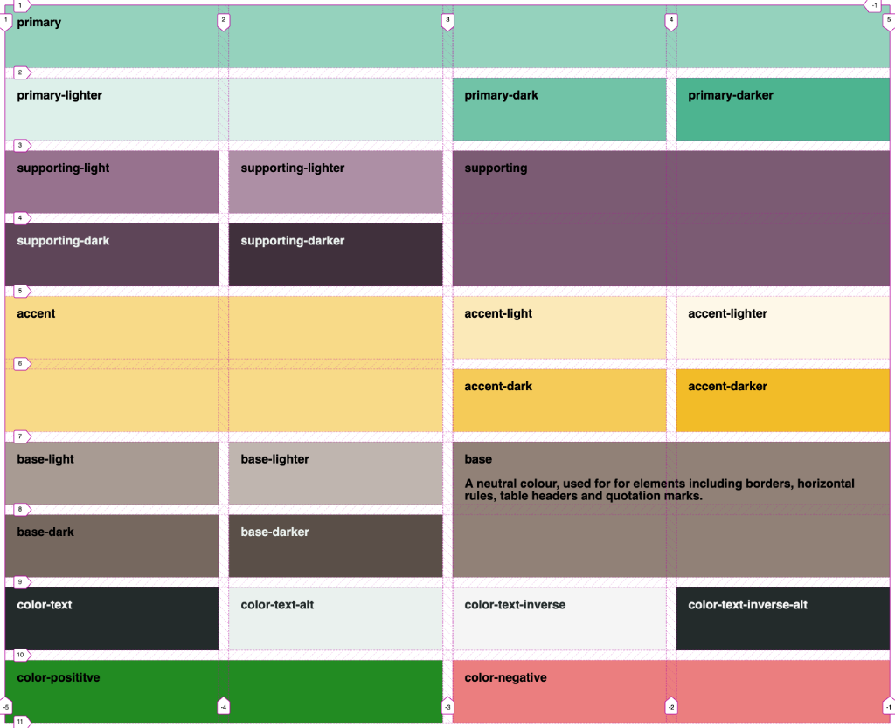
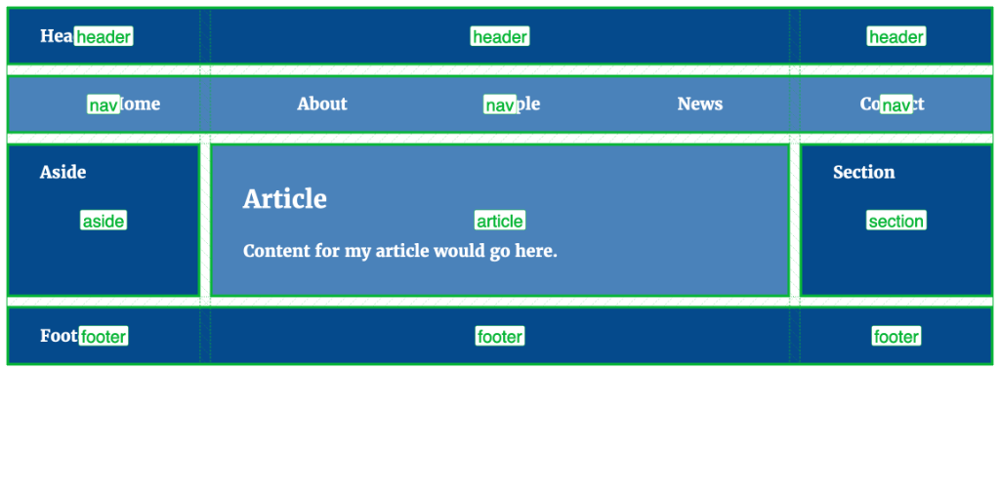
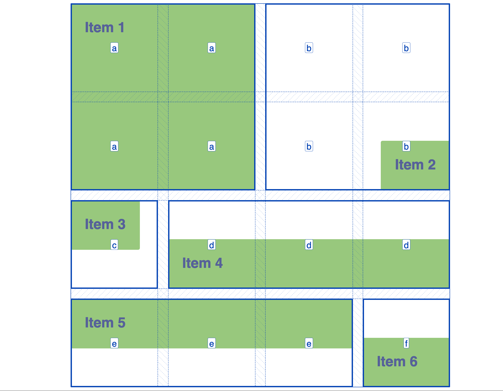
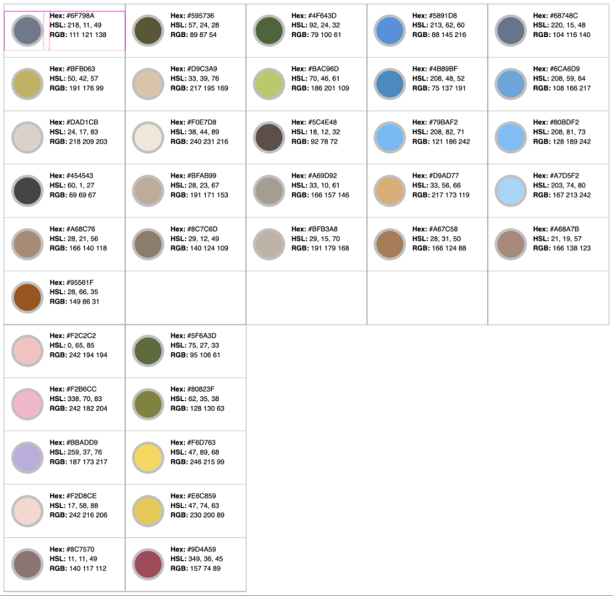
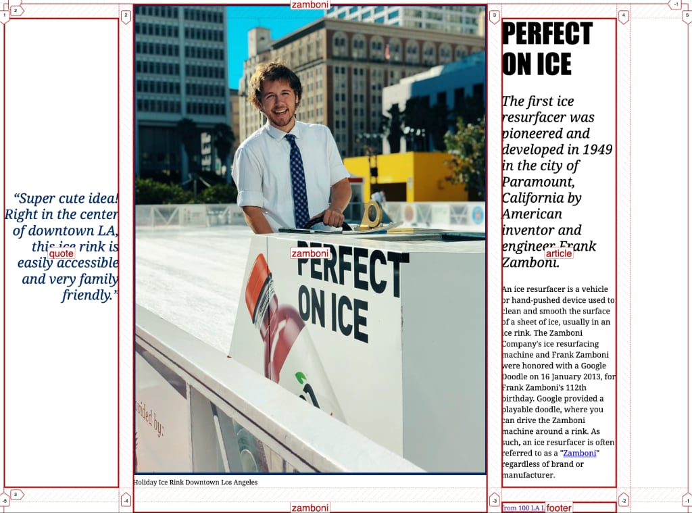
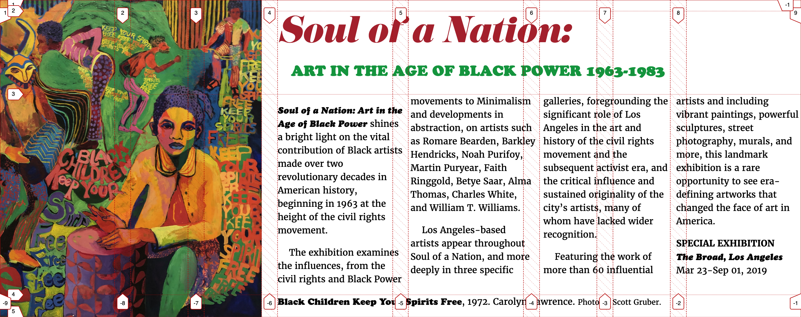
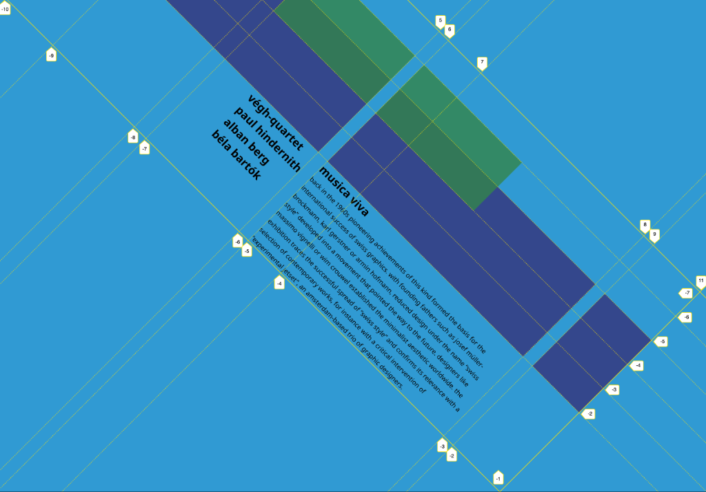
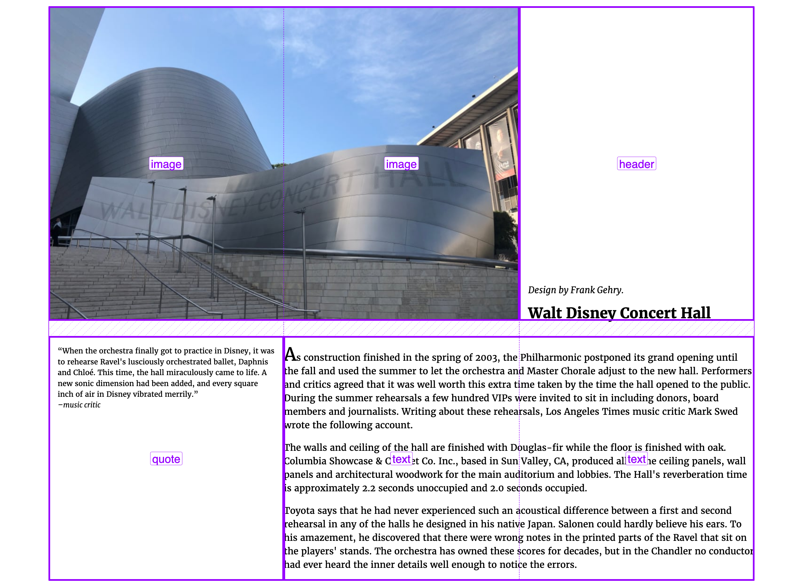

footer: [css.la](https://css.la) | @cssdotla



--- 


Thank you 
@theblacktux @postmarkapp #PostmarkPizzaParty

^ Lex Roman, Joey Nichols, Monica Durkee, Kavita Viswanathan, Michael Choa

---
[.hide-footer]


---
# [fit] CSS Grid
^ what are the foundations. what doesn't change?

---
[.hide-footer]
# Sample 1: Laying out a grid



---
[.hide-footer]
# Sample 2: Page layout


---
[.hide-footer]
# Sample 3: Aligning things


---
[.hide-footer]
# Sample 4: Support queries flexbox & grid


---
[.hide-footer]
# Sample 5


---
[.hide-footer]
# Sample 6


---
[.hide-footer]
# Sample 7


---
[.hide-footer]
# Sample 8


---
[.hide-footer]
# Sample 9: Image layout and multi-column


--- 

```css
.grid {
    display: grid;
    grid-template-columns: 1fr 1fr 1fr 1fr;
    grid-template-rows: auto;
    grid-gap: 1em;
}
```
---

```css
.grid {
  display: grid;
  grid-gap: 1vw;
  grid-template-areas:
    "header"
    "nav"
    "article"
    "aside"
    "section"
    "footer";
}
```
---
```css
@media (min-width: 600px) {
.grid {
  grid-template-columns: 1fr 3fr 1fr;
  grid-template-areas:
    "header header header"
    "nav nav nav"
    "aside article section"
    "footer footer footer";
  }
}
```
---


```css 


header {
  grid-area: header:
}

nav {
  grid-area: nav;
}

article {
  grid-area: article;
}


```
---
```css

figcaption {
  grid-column: 4 / 8;
  grid-row: 4;
}

img {
  grid-column: 1 / 4;
  grid-row: 1 / 5;  
}
```

---

# Creating a grid

- `display: grid`
- `grid-template-columns`
- `grid-template-rows`
- `grid-template-areas`

---

# Gaps
- `grid-column-gap`
- `grid-row-gap`
- `grid-gap`
- `grid-gap: 20px;`


```css

```

---

# Positioning things
- `grid-column`
- `grid-row`
- `grid-area` 
- `grid-column: 1 / -1;`

---

# Aligning things

- `justify-content`
- `align-content`
- `justify-items`
- `align-items`
- `justify-self`
- `align-self`

---
# 7 attributes to align things

- `start`
- `end`
- `center`
- `stretch`
- `space-between`, `space-around`, `space-evenly`

^ `start`: flush grid to start of the axis
^ `end`: flush grid to end of the axis
^ `center`: align grid to center of the axis
^ `stretch`: grid fills the axis (default value)
^ `space-between`: whitespace between grid items. 
^ `space-around`: whitespace around each grid item
^ `space-evenly`: whitespace evenly around all grid items including the ends

---

# Sizing your grid
- rem
- em
- px
- fr
- minmax()

---

# [fit] What's next?
--- 

#[fit] https://www.css.la/

---

# Thank you

